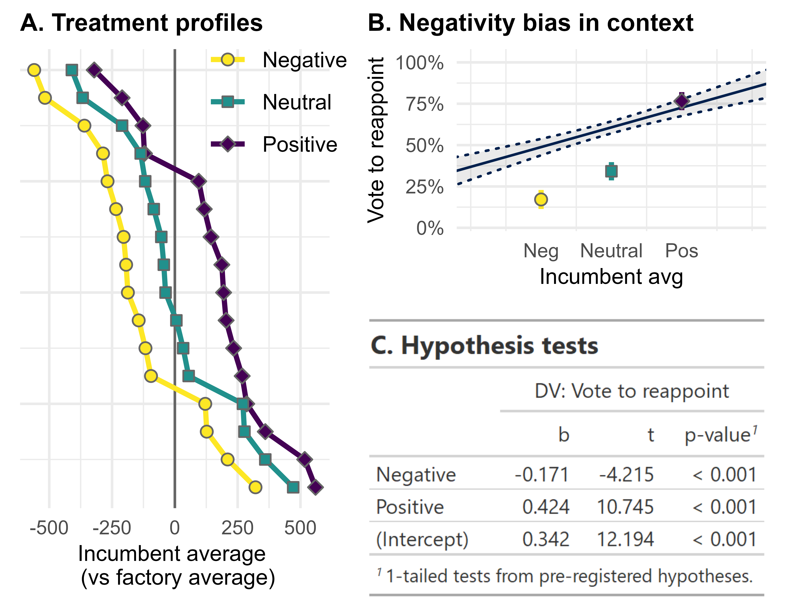

```{r setup, include=FALSE}
# Set some markdown options
  options(htmltools.dir.version = FALSE)
  knitr::opts_chunk$set(echo = FALSE)

# packages and directory
  library(tidyverse)
  library(kableExtra)
  library(gt)
  
  gap = gapminder::gapminder
```

```{r results='hide'}
knitr::opts_chunk$set(
  message=FALSE, warning=FALSE, eval = TRUE, echo = FALSE, 
  fig.align = 'center'
)
```

This is a super basic look at R Markdown. There are lots of good, free resources available as you dive into the particulars. I like [Yihui Xie et al.'s RMD Cookbook](https://bookdown.org/yihui/rmarkdown-cookbook/) as a starting point.

# Overview

## What is R Markdown?

The official answer from the RMD folks:

> Markdown is a simple formatting syntax for authoring HTML, PDF, and MS Word documents. For more > details on using R Markdown see <http://rmarkdown.rstudio.com>.

It's basically like having the functionality of R and a typesetting software (like MS Word) in the same place. This allows you to combine text and code in the same document and then compile it into professional outpust like reports, codebooks, or slide decks. For example, I use R Markdown for my SIS 600 slides and the R Survival Guide. You can see the `.md` code and outputs at [my GitHub page](https://github.com/austin-hart-pols).

## Why bother?

There are a number of major advantages for folks working in data analytic professions:

- Combine composition and analysis
- Extreme ease of updating your work for...
  - Style changes
  - Updated, new, or corrected data
  - New or removed figures and tables
- Scaling up to professional work is a cinch 


# Markdown basics

A markdown file starts with a YAML header and typically includes text and code chunks.

## Starting with YAML

The YAML header specifies the metadata about the document you want to produce and how you want to render it. It typically includes the title, author, and date as well as the format for the output (e.g., pdf, html, Word.). It can also include loads of options about tables of contents, references, style, theme, and much more.

A typical YAML header for a simple report might look like this:

```{r, eval=FALSE,echo=TRUE}

---
title: "Getting to know R Markdown"
author: "Austin Hart"
date: "3/21/2022"
output:
  html_document:
    theme: spacelab
    highlight: zenburn
---

```

I'm fond of the `bookdown` approach. It gives a nice style update, and it's very good for numbering figures and tables. For this, install the `bookdown` package and then specify the `output` option in the YAML header above with `output: bookdown::html_document2`.

## Writing text

Text is pretty simple here. Just type. 

You use `#`, `##`, etc. at the start of a line to specify section and subsection titles.

Use characters like `-` or `*` to start itemized lists and `1.` or `A.` for enumerated lists.

Note that you have to have a physical line break between paragraphs.
This is on a new line, but it gets sucked into the paragraph above because I don't have a blank line.

You can also go `**BOLD**` or `*italic*` with ease.

## Code chunks

When you click the **Knit** button, a document will be generated that includes both content as well as the output of any embedded R code chunks within the document. You can embed an R code chunk like this:

```{r gaptable}
  gap %>% 
    count(continent) %>% gt() %>%
  tab_header(
    title = "I made a table!",
    subtitle = "and stuff"
  )
```

You can also execute inline code. For example, the mean life expectancy from the Gapminder data is equal to `r round(mean(gapminder::gapminder$lifeExp),2)`. 


# Preparing for analysis

## The setup chunk
Like any R script, you want to start by calling important packages, loading data, and maybe more. This `setup` chunk should go right at the start. For example:

````
```{r setup, include=FALSE}`r ''`
# markdown options
  options(htmltools.dir.version = FALSE)
  knitr::opts_chunk$set(echo = FALSE)

# packages  
  library(tidyverse)
  library(kableExtra)
  library(gt)

# data
  gap = gapminder::gapminder
```
````

Note that the directory will automatically be set as the folder where you save your `.Rmd` markdown script.


## Including Plots

You can print plots directly out of `ggplot2`:

```{r pressure, fig.width=4, fig.height=1.5, fig.cap = "From ggplot2"}
  gap %>% 
  ggplot(aes(x = lifeExp)) + geom_histogram(color = 'white') + 
  labs(x = 'Life expectancy (years)') + theme_minimal()
```

Or you can add an image from a file using `knitr`:
```{r, echo=FALSE, out.width="50%", fig.cap="A nice image."}

```

## Adding tables

There are lots of table options, including `knitr`, `gt` (mostly for html output), and `stargazer` for regression tables. Note that in some cases, you'll need to specify `results = 'asis'` in the code chunk options.

```{r reg, results = 'asis'}
m1 = lm(lifeExp ~ gdpPercap, data = gap)
m2 = lm(lifeExp ~ gdpPercap + continent, data = gap)

stargazer::stargazer(m1,m2, type = 'html', keep.stat = 'n')

```

